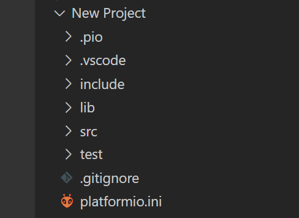
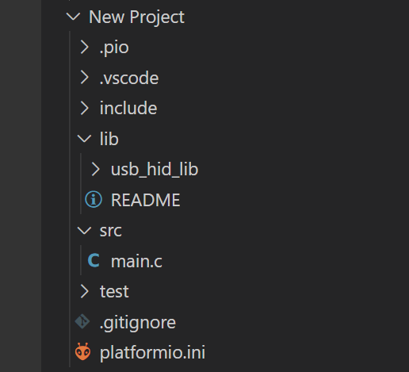
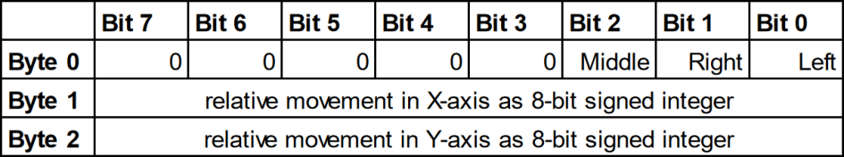

*An STM32-based USB HID device to periodically shake your mouse pointer.*

<!--more-->

# Introduction
Sometimes I would find it useful to have a device that periodically would shake my mouse to prevent a PC from going to standby. Of course, you could always change or deactivate the standby functionality (if your organization allows you to do these changes), but sometimes you just don't want to fiddle around with these settings. One way of solving this would be to create a mechanical device that physically moves the mouse. However, a much simpler solution is to take an STM32 microcontroller and make use of the in-built USB 2.0 interface. In this article, I will show you how I have implemented exactly this. You can also find [this project on GitHub](https://github.com/dadul96/STM32F103CB_Maple_Mini_Clone_USB_Mouse_Jiggler).

# Hardware Setup
First things first, what microcontroller will be used? In 2011 [Leaflabs](https://www.leaflabs.com/maple) released their STM32F103CBT6-based development board called *Maple Mini*. It was discontinued in March 2015, but there are still some manufacturers out there selling [Maple Mini clones](https://stm32-base.org/boards/STM32F103C8T6-Baite-Maple-Mini-Clone). A few years back I ordered a couple of them and that's why I still use this quite *exotic* development board compared to the more widely known [Blue Pill boards](https://stm32-base.org/boards/STM32F103C8T6-Blue-Pill). 

In order to comply with the USB 2.0 full-speed electrical specification, it is also necessary to add a 1k5 Ohm pullup resistor between the USB D+ line (D23 = GPIOA, GPIO12) and VCC (3.0 - 3.6V). This ensures that the host (PC) detects the device on the bus.



The Maple Mini has the advantage that there is already a 1k5 Ohm resistor onboard which is switchable via a transistor and the signal of the GPIOB9 pin.




# IDE and Framework
Although the Maple Mini has quite good support for the Arduino IDE and Framework, I prefer to use [PlatformIO](https://platformio.org/) on [Visual Studio Code](https://code.visualstudio.com/) in combination with the open-source ARM Cortex library called [libopencm3](https://libopencm3.org/). In my case, no bootloader is installed on the microcontroller, and therefore an [ST-Link Debugger](https://stm32-base.org/boards/Debugger-STM32F101C8T6-STLINKV2) and [dfu-util](http://dfu-util.sourceforge.net/) will be used to flash the device.

# Implementation
## Project Folder Structure
When creating a new project in PlatformIO the following folder structure will be created:


Since I want to make the USB HID implementation re-useable for future projects, I will put the USB-specific code inside the *lib*-folder in a separate folder called *usb_hid_lib*.

The main-file is of course placed in the *src*-folder and contains the function calls of this *usb_hid_lib* library.


## usb_hid_lib
### delay.c
The goal is to have a mouse jiggler that periodically moves the mouse pointer. To execute such periodic events it is useful to have some sort of a delay-implementation. This delay-function can then later on also be used inside the USB HID code for the *USB_autodetect()*-function that will trigger a re-enumeration of the device on the bus. But more on that later.

In order to not waste any of the timer/counter modules for the delay, it is a good idea to make use of the [24-bit SysTick timer](https://developer.arm.com/documentation/dui0552/a/cortex-m3-peripherals/system-timer--systick) on the ARM Cortex M3 (STM32F103).

Therefore the following libopencm3-files need to be included:
```cpp
#include <libopencm3/cm3/systick.h>
#include <libopencm3/stm32/rcc.h>
```

The delay-function is implemented in the following manner:
```cpp
void delay_ms(uint32_t milliseconds)
{
	static uint8_t init_done_flag = 0;
	static uint32_t reload_val = 0;
	static uint32_t ticks_per_ms = 0;
	uint32_t num_of_reloads = 0;

	if (init_done_flag == 0)
	{
		/* set SYSCLK to 72MHz using HSE 8MHz oscillator: */
		rcc_clock_setup_in_hse_8mhz_out_72mhz();

		/* check csr clocksource and set ticks_per_ms accordingly: */
		if ((STK_CSR & STK_CSR_CLKSOURCE) == STK_CSR_CLKSOURCE_AHB)
		{
			ticks_per_ms = 72000U; /* 72MHz = 72M ticks/s -> divide by 1000 to get ticks/ms */
		}
		else /* == STK_CSR_CLKSOURCE_AHB_DIV8 */
		{
			ticks_per_ms = 72000U / 8U;
		}

		/* get reload value or set own one if 0: */
		reload_val = systick_get_reload();
		if (reload_val == 0)
		{
			systick_set_reload(ticks_per_ms);
			reload_val = ticks_per_ms;
		}

		/* enable systick and set init_done_flag: */
		systick_counter_enable();
		init_done_flag = 1;
	}

	while ((num_of_reloads * reload_val) < (milliseconds * ticks_per_ms))
	{
		if (systick_get_countflag()) /* flag gets automatically cleared when read */
		{
			num_of_reloads++;
		}
	}
}
```
The aim of this implementation is to be flexible/generic with the use of the SysTick timer. In other words, I want this implementation to be somewhat independent of the previous settings that were made to the SysTick timer (in case it was already used and configured in the code before). How is this accomplished?

The first thing in the initialization is the setup of the system clock (SYSCLK). Since this code should only be re-usable on other Maple Mini projects, I have assumed that the clock will always make use of the on-board HSE (**H**igh-**S**peed **E**xternal) 8MHz oscillator and that the CPU clock will always be set to the maximum of 72MHz. This 72MHz CPU clock also fits nicely to the required 48MHz for the USB interface by just using a 1.5 clock divider. Because of this assumption, that in every future project the same clock settings will be used, it does not matter that some clock configuration inside this delay-function might have been already called somewhere else in the code before.

In the next step, it is checked whether the SYSCLK clock source (which is coming through the AHB prescaler) has the SysTick divider of 8 selected or if it directly uses the AHB frequency:





According to this configuration, the variable *ticks_per_ms* either has the value of 72000 or 72000/8. Using the value of this variable, the reload value of the SysTick timer can be set accordingly. But also here to stay flexible and as generic as possible, it is first checked if there is already a reload value set or not. In the case that there is currently no reload value set (reload value == 0), the content of the *ticks_per_ms* variable will be used as the reload value. Otherwise, we work with the already given reload value inside the register. The only caveat of this approach is that in case the already given reload value is larger than the value of *ticks_per_ms* we are not able to exactly achieve the desired amount of milliseconds. Depending on the requested delay value and also the chosen SysTick divider, this effect might be either negligible or really bad.

**Worst case assessment:**
The divider of 8 is enabled and therefore we need 9000 ticks for 1ms delay. In case the reload value in the register is set to the highest value (0x00FFFFFF = 16777215) the smallest delay we can produce would be 16777215/9000 = **1864ms**. When the AHB clock is directly used, this value reduces by a factor of 8 and the minimal delay would then be **233ms**. I have decided to still keep this delay implementation as generic as possible, with the least influence on the surrounding code as possible. Therefore, it is necessary to just **keep these limits in mind** in the future.


### usbhid.c
In this chapter, I just want to highlight the most important things in the code of the USB HID implementation. The full code (+ header files) can of course be found in the [GitHub repo](https://github.com/dadul96/STM32F103CB_Maple_Mini_Clone_USB_Mouse_Jiggler).

In order to turn the STM32 microcontroller into a USB device, a bunch of USB configurations need to be set using various USB descriptors. A basic USB descriptor hierarchy could look like this:



Each USB device can have exactly one device descriptor. The device descriptor contains information about the device class (i.e., HID class), the sub-class, and the device protocol. Additionally, the vendor and product IDs are set here. Another important element in this descriptor struct is the *bNumConfigurations* setting, which defines the number of configuration descriptors for this device.

```cpp
static const struct usb_device_descriptor dev = {
	.bLength = USB_DT_DEVICE_SIZE,
	.bDescriptorType = USB_DT_DEVICE,
	.bcdUSB = 0x0200,		/* USB 2.0 */
	.bDeviceClass = USB_CLASS_HID,
	.bDeviceSubClass = USB_HID_SUBCLASS_BOOT_INTERFACE,
	.bDeviceProtocol = USB_HID_INTERFACE_PROTOCOL_MOUSE,
	.bMaxPacketSize0 = USB_HID_PACKET_SIZE,
	.idVendor = 0x0483,		/* STM */
	.idProduct = 0x5710,	/* Joystick in FS Mode */
	.bcdDevice = 0x0100,	/* Device Release Number: 1.0 */
	.iManufacturer = 1,
	.iProduct = 2,
	.iSerialNumber = 3,
	.bNumConfigurations = 1,
};
```

In the case of this USB HID mouse jiggler, only one configuration descriptor is necessary. This descriptor gives information such as the number of interfaces (i.e., .bNumInterfaces = 1), the maximum power the device will draw, and if the device is powered over the BUS or self-powered.

```cpp
static const struct usb_config_descriptor config = {
	.bLength = USB_DT_CONFIGURATION_SIZE,
	.bDescriptorType = USB_DT_CONFIGURATION,
	.wTotalLength = USB_DT_CONFIGURATION_SIZE+USB_DT_INTERFACE_SIZE+USB_DT_ENDPOINT_SIZE+(sizeof(hid_function)),
	.bNumInterfaces = 1,
	.bConfigurationValue = 1,
	.iConfiguration = 0,
	.bmAttributes = 0x80,	/* BUS powered Device */
	.bMaxPower = 0x64,		/* 0x64 -> 100d -> 100*2mA=200mA */

	.interface = &iface,
};
```

In the project here, there is only one interface used and therefore only one interface descriptor is necessary. Besides the information on how many endpoints are inside the interface, it also contains information about the interface class, sub-class, and the used protocol.

```cpp
static const struct usb_interface_descriptor hid_iface = {
	.bLength = USB_DT_INTERFACE_SIZE,
	.bDescriptorType = USB_DT_INTERFACE,
	.bInterfaceNumber = 0,
	.bAlternateSetting = 0,
	.bNumEndpoints = 1,
	.bInterfaceClass = USB_CLASS_HID,
	.bInterfaceSubClass = USB_HID_SUBCLASS_BOOT_INTERFACE,
	.bInterfaceProtocol = USB_HID_INTERFACE_PROTOCOL_MOUSE,
	.iInterface = 0,

	.endpoint = &hid_endpoint,

	.extra = &hid_function,
	.extralen = sizeof(hid_function),
};

static const struct usb_interface iface = {
	.num_altsetting = 1,
	.altsetting = &hid_iface,
};
```

The endpoint descriptor basically gives information about the endpoint type, the address & direction, the transfer type (i.e., interrupt), the maximum packet size, and the endpoint polling interval in frame counts (for the USB2.0 standard, 1 frame is equal to 1ms).

```cpp
static const struct usb_endpoint_descriptor hid_endpoint = {
	.bLength = USB_DT_ENDPOINT_SIZE,
	.bDescriptorType = USB_DT_ENDPOINT,
	.bEndpointAddress = 0x81,	/* bit[7]=1b -> direction: IN; bit[3:0]=001b -> endpoint no. 1 */
	.bmAttributes = USB_ENDPOINT_ATTR_INTERRUPT,
	.wMaxPacketSize = HID_DATA_PACKET_SIZE,
	.bInterval = 20,			/* polling interval in frames (USB2.0: 1 frame = 1ms) -> 20ms */
};
```

The interface descriptor not only links to the endpoint descriptor but also to the class-specific (i.e., HID) descriptor. This HID descriptor defines the length and type of the subordinate descriptors and also references to the HID report descriptor.

```cpp
static const uint8_t hid_report_descriptor[] = {
	0x05, 0x01, /* USAGE_PAGE (Generic Desktop)         */
	0x09, 0x02, /* USAGE (Mouse)                        */
	0xa1, 0x01, /* COLLECTION (Application)             */
	0x09, 0x01, /*   USAGE (Pointer)                    */
	0xa1, 0x00, /*   COLLECTION (Physical)              */
	0x05, 0x09, /*     USAGE_PAGE (Button)              */
	0x19, 0x01, /*     USAGE_MINIMUM (Button 1)         */
	0x29, 0x03, /*     USAGE_MAXIMUM (Button 3)         */
	0x15, 0x00, /*     LOGICAL_MINIMUM (0)              */
	0x25, 0x01, /*     LOGICAL_MAXIMUM (1)              */
	0x95, 0x03, /*     REPORT_COUNT (3)                 */
	0x75, 0x01, /*     REPORT_SIZE (1)                  */
	0x81, 0x02, /*     INPUT (Data,Var,Abs)             */
	0x95, 0x01, /*     REPORT_COUNT (1)                 */
	0x75, 0x05, /*     REPORT_SIZE (5)                  */
	0x81, 0x01, /*     INPUT (Cnst,Ary,Abs)             */
	0x05, 0x01, /*     USAGE_PAGE (Generic Desktop)     */
	0x09, 0x30, /*     USAGE (X)                        */
	0x09, 0x31, /*     USAGE (Y)                        */
	0x15, 0x81, /*     LOGICAL_MINIMUM (-127)           */
	0x25, 0x7f, /*     LOGICAL_MAXIMUM (127)            */
	0x75, 0x08, /*     REPORT_SIZE (8)                  */
	0x95, 0x02, /*     REPORT_COUNT (2)                 */
	0x81, 0x06, /*     INPUT (Data,Var,Rel)             */
	0xc0,       /*   END_COLLECTION                     */
	0xc0        /* END_COLLECTION                       */
};

static const struct {
	struct usb_hid_descriptor hid_descriptor;
	struct {
		uint8_t bReportDescriptorType;
		uint16_t wDescriptorLength;
	} __attribute__((packed)) hid_report;
} __attribute__((packed)) hid_function = {
	.hid_descriptor = {
		.bLength = sizeof(hid_function),
		.bDescriptorType = USB_DT_HID,
		.bcdHID = 0x0100,
		.bCountryCode = 13, /* International (ISO) */
		.bNumDescriptors = 1,
	},
	.hid_report = {
		.bReportDescriptorType = USB_DT_REPORT,
		.wDescriptorLength = sizeof(hid_report_descriptor),
	}
};
```

In this case here, the HID report descriptor configures a basic three-button mouse, that can click left, right, and middle. It can move in X and Y directions, but scrolling is not implemented. This results in the following data package:



The relative position values of X and Y are signed integer values and since they are only of 8-bit size, the minimum and maximum movement are -127 and 127 pixels. The buttons can only have the value 0 or 1 and are of a latching nature - this means setting the left button to 1 means that the HID device will *click and hold* the button until it is set back to 0.

The whole USB HID configuration gives the following descriptor tree. String descriptors would add human-readable information to the other descriptors. And the physical descriptor would provide information about the specific part of the human body that is activating a control. But since both are optional I have omitted them in my implementation.



Since all required USB descriptors are configured, we can now focus on the remaining part of the code (for a detailed code explanation see below):

```cpp
usbd_device *usb_device;
static uint8_t usbd_control_buffer[128];

static enum usbd_request_return_codes hid_control_request_callback(usbd_device *usbd_dev, struct usb_setup_data *req, uint8_t **buf, uint16_t *len,
			void (**complete)(usbd_device *, struct usb_setup_data *))
{
	(void)complete;
	(void)buf;
	(void)usbd_dev;

	if((req->bmRequestType != 0x81) ||				// D7: 1=Device-to-host; D6-D5: 0=Standard; D4-D0: 1=Interface
	   (req->bRequest != USB_REQ_GET_DESCRIPTOR) ||	// GET_DESCRIPTOR = 6
	   (req->wValue != 0x2200))						// Descriptor Type (0x22 = HID report) and Descriptor Index (0x00)
	{
		return USBD_REQ_NOTSUPP;
	}

	/* Handle the HID report descriptor. */
	*buf = (uint8_t *)hid_report_descriptor;
	*len = sizeof(hid_report_descriptor);

	return USBD_REQ_HANDLED;
}

static void hid_set_config_callback(usbd_device *usbd_dev, uint16_t wValue)
{
	(void)usbd_dev;
	(void)wValue;

	usbd_ep_setup(usbd_dev, 0x81, USB_ENDPOINT_ATTR_INTERRUPT, 4, ((void *)0));

	usbd_register_control_callback(
				usbd_dev,
				USB_REQ_TYPE_STANDARD | USB_REQ_TYPE_INTERFACE,
				USB_REQ_TYPE_TYPE | USB_REQ_TYPE_RECIPIENT,
				hid_control_request_callback);
}

/* The USB_autodetect()-function is used to re-enumerate the USB device on the PC,
so that after flashing, the device does not need to be physically reconnected. Additionally, 
USB D+ line (D23 = GPIOA, GPIO12) needs to be connected via a 1k5 Ohm pullup resistor to 
VCC (3.0 - 3.6V) to be compliant with the USB 2.0 full-speed electrical specification. */
static void USB_autodetect(void)
{
    rcc_periph_clock_enable(RCC_GPIOA);

#if (USB_DP_1K5_PULLUP_SWITCHABLE_VIA_GPIOB9 == 1U)
    /* on the Maple Mini development board GPIOB 9 is used switch a transistor to dis-/connect an on-board
    1k5 Ohm pullup resistor to USB D+ line */
	rcc_periph_clock_enable(RCC_GPIOB);
	gpio_set_mode(GPIOB, GPIO_MODE_OUTPUT_50_MHZ, GPIO_CNF_OUTPUT_PUSHPULL, GPIO9);
	gpio_clear(GPIOB, GPIO9);
	delay_ms(250);
#else
    /* in case the 1k5 Ohm pullup resistor is permanently connected to USB D+ line:
    set GPIOA, GPIO12 (USB D+ line) to output push-pull low (0V) and wait for 250ms */
    gpio_set_mode(GPIOA, GPIO_MODE_OUTPUT_50_MHZ, GPIO_CNF_OUTPUT_PUSHPULL, GPIO12);
    gpio_clear(GPIOA, GPIO12);
    delay_ms(250);
#endif
    
    /* set to alternate function (USB): */
    gpio_set_mode(GPIOA, GPIO_MODE_OUTPUT_50_MHZ, GPIO_CNF_OUTPUT_ALTFN_PUSHPULL, GPIO12); /* USB D+ line */
    gpio_set_mode(GPIOA, GPIO_MODE_OUTPUT_50_MHZ, GPIO_CNF_OUTPUT_ALTFN_PUSHPULL, GPIO11); /* USB D- line */
    delay_ms(250);
}

void usb_hid_init(void)
{
	USB_autodetect();
    usb_device = usbd_init(&st_usbfs_v1_usb_driver, &dev, &config, usb_strings, 3, usbd_control_buffer, sizeof(usbd_control_buffer));
	usbd_register_set_config_callback(usb_device, hid_set_config_callback);
    nvic_set_priority(USB_IRQ, IRQ_PRI_USB);
	nvic_enable_irq(USB_IRQ);
}

void usb_hid_move_mouse_xy(int8_t x, int8_t y)
{
	struct mouse_report_data_t {
		uint8_t buttons;
		int8_t move_x;
		int8_t move_y;
	} __attribute__((packed)) mouse_report_data = {
		.buttons = 0, // 0=no, 1=left, 2=right, 4=middle
		.move_x = x,
		.move_y = y,
	};

	usbd_ep_write_packet(usb_device, 0x81, &mouse_report_data, sizeof(mouse_report_data));
}

void USB_ISR(void)
{
	usbd_poll(usb_device);
}
```

There are only two functions exposed to the user via the function declaration in the header file:
 * **void usb_hid_init(void):**
	* This init function calls the USB_autodetect()-function which is used to connect the USB D+ line via a 1k5 Ohm pullup resistor to VCC (the ensures that the device is re-enumerated on the bus). Additionally, the GPIO pins which are connected to the USB data lines are set to alternative output function push-pull.
	* In the next step, the USB device is initialized with the usbd_init()-function.
	* After the USB device init, the usbd_register_set_config_callback()-function is called. There the callback for the device configuration function (hid_set_config_callback()) is [registered](https://stackoverflow.com/questions/8590335/what-do-you-mean-by-registering-a-callback-function-in-c).
	* In the last step, the low-priority interrupt for USB is enabled. This allows us to run the usbd_poll()-function inside the interrupt service routine which in my case is called USB_ISR(void) (with `USB_ISR` just being a macro for `usb_lp_can_rx0_isr`).
	
 * **void usb_hid_move_mouse_xy(int8_t x, int8_t y):**
	* This function contains the data type struct that represents the mouse data according to the HID report settings. Meaning, that we have an unsigned 8-bit integer for the button states (0=no, 1=left, 2=right, 4=middle). As well as two signed 8-bit integers for X/Y-axis movements. For this mouse jiggler implementation we do not make use of the buttons and therefore set it to `0` *(aka no buttons pressed)*.
	* Last but not least, this data is sent with the usbd_ep_write_packet()-function at endpoint address 0x81.
	
Only the following two functions have not been described until now:
 * **hid_set_config_callback(...):**
	* This function has already been mentioned above where the config callback has been registered. Essentially, we use this function to set up the USB device endpoint.
	* Additionally, the callback for the control request function (hid_control_request_callback()) is registered here.
 * **hid_control_request_callback(...):**
	* *USB background: USB devices need to respond to requests from the host (PC). Such requests are made using control transfers. The setup packet which is sent to the device contains the request and its parameters.*
	* This function handles such requests. We basically check if the request is of type *"device-to-host"* and *"interface"*. Then we verify that the request is a `GET_DESCRIPTOR` request and that the descriptor type is *"HID report"* with index *"0"*. If this is the case, we provide the *hid_report_descriptor*-variable and its size. Otherwise, we return a `USBD_REQ_NOTSUPP` (*aka "request not supported"*) message.

## src
### main.c
The finished *usbhid*-library can then be used in the main-function like this:

```cpp
#include "usbhid.h"

int main(void)
{
	usb_hid_init();

	while (1)
	{
		delay_ms(1000);
		usb_hid_move_mouse_xy(10, 0);
		delay_ms(1000);
		usb_hid_move_mouse_xy(-10, 0);
	}		
}
```

# Result
This would result in the following behavior of the mouse pointer:
