*Mounting a headlamp on a mountain bike using photogrammetry, CAD, 3D printing, and trial & error* 😁

<!--more-->

# Introduction
So I have this lightweight mountain bike which I really enjoy driving around. Everything is trimmed to be lightweight and therefore some things like a bell or lights and reflectors are missing. Usually, this is no problem since I only drive it during daylight, but sometimes I would like to go for a ride later in the afternoon - with the possibility to get dark outside before I reach home again. Of course, I could just buy some off-the-shelf bike lights, but this has several drawbacks:
 * First, this would be plane a$$ boring and not my style.
 * A permanently mounted light on the bike handle is not useful at all when for example fixing a tire puncture in the middle of the woods in the dark.
 * I already own a quite good headlamp which I would take with me anyway, because of the point above. Then I could just clip it off the bike and mount it on my head strap and vice versa.

That's why I came to the conclusion that it would be best to just design a mounting bracket for my bike. This allows me to completely drive without the light or just throw the headlamp into my backpack and clip it on in case it gets dusky. This way the only permanently added weight would be the mounting bracket. 

# Goals to achieve
It should be...
* ... 3D printed only -> cheap and easy to manufacture.
* ... lightweight.
* ... aesthetically pleasing.
* ... mounted in a way that it can survive a mild crash.
* ... easy to mount.
* ... able to mount it without any permanent modifications (i.e. drilling) on the bike.

# Planned Steps
1. Reverse engineer how the lamp is mounted on the head strap.
2. Design a simple interface/mount to just clip on the lamp itself.
3. Test the design with an actual 3D printed test piece to re-iterate the design until finished.
4. Take this test piece and check for possible mounting spots on the bike and determine the best one.
5. Scan the bike handle with the help of [photogrammetry](https://en.wikipedia.org/wiki/Photogrammetry).
6. After generating a 3D model of the bike handle the rest of the mount can be designed to interface with the bike.
7. Print the model and re-iterate until I'm happy with the result.

# Execution
## Reverse engineering the Mount on the Headstrap
The headlamp used for this project is a Fenix HM50R V2.0. As you can see in the pictures below, the design allows the lamp to be easily removed from the head strap.





Besides this convenient feature, the headlamp also offers a quite good lighting performance in regards to brightness and runtime (see graph below).



Using a caliper the adapter plate of the head strap has been measured and the prototype model has been designed in [Fusion 360](https://www.autodesk.com/products/fusion-360/personal).
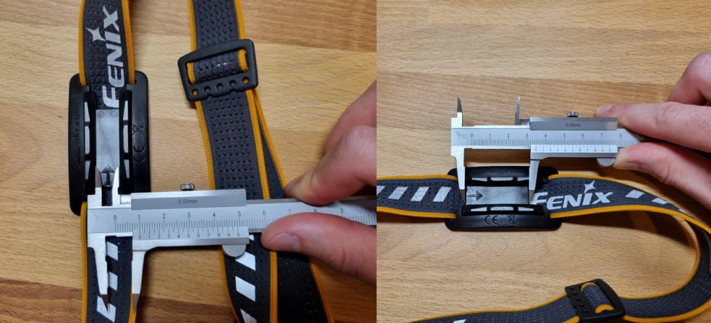

During the design phase, several prototypes have been 3D printed (on my [Voron V0](https://vorondesign.com/voron0)) in black ABS.
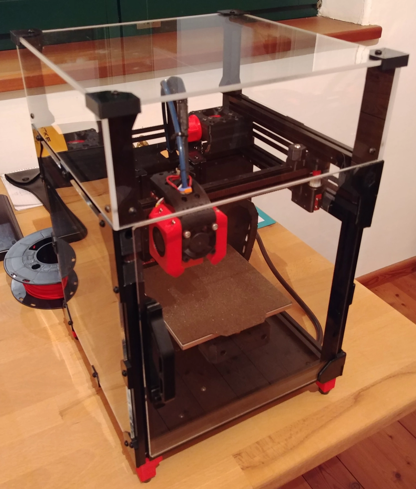

The physical prototypes enabled proper testing of the clip mechanism as well as its haptic feel of it.
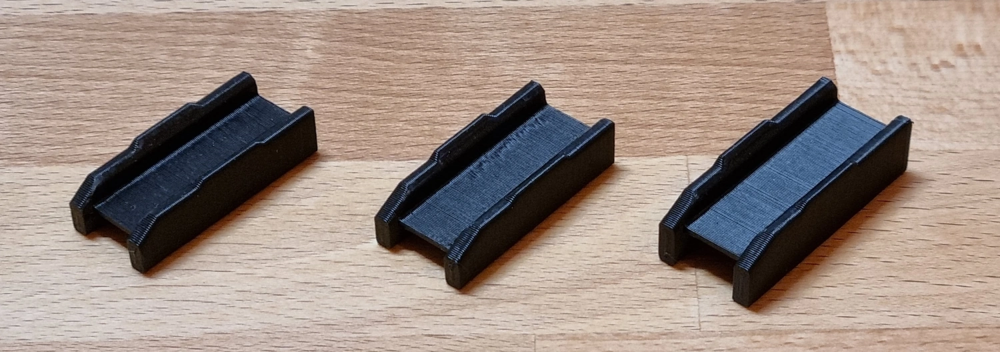

In the next step, I took this prototype with the mounted light to the bike and searched for the best mounting location. It seemed that the [stem](https://en.wikipedia.org/wiki/Stem_(bicycle_part)) was the best place to mount the light since there were already 4pcs. of M6 screws attached which clamped down the handlebar.

## Scanning the Handle with Photogrammetry
The next action was to scan the bike handle with the help of photogrammetry.

### But what is photogrammetry?

The [Wikipedia article](https://en.wikipedia.org/wiki/Photogrammetry) offers a quite detailed description of what photogrammetry actually is, but explained in my own words:

It is a technique to get 3D information about a physical object with the help of images from the object. Algorithms (e.g. [SIFT (Scale-invariant feature transform)](https://en.wikipedia.org/wiki/Scale-invariant_feature_transform)) are then used to calculate the 3D data from the given pictures. Essentially, you take a lot of pictures of the object from different angles, and software tools are used to calculate a point cloud and mesh out of the given data. This mesh can then be converted into an STL file (**S**tandard **T**riangle **L**anguage) for example.

### What is important when scanning (aka taking pictures of the object)?
* The object of desire should have a good color separation from the background.
* It should be non-reflective and evenly lit.
* More pictures are better.
* Pictures should overlap each other (2/3 overlap).
* Some software tools prefer to have the pictures ordered.
* The object to be scanned should fill the frame of the picture and not the background.
* Avoid harsh shadows.
* The images should be sharp and not shaky.
* Ideally, the camera settings such as focal length, aperture, and white balance should be kept constant. Of course, this also includes that all pictures should be taken with the same camera - duh.
* Avoid large areas with solid color and no texture. Or add texture using paint or stickers.
* For small objects, a turntable in combination with a tripod and studio lighting would be ideal.

### What software is out there? And what have I used?
* [AliceVision Meshroom](https://alicevision.org/) (FOSS)
* [3DF Zephyr](https://www.3dflow.net/3df-zephyr-photogrammetry-software/) (Free + Paid)
* [RealityCapture](https://www.capturingreality.com/) (Paid)
* [Regard3D](https://www.regard3d.org/) (FOSS)
* [PhotoModeler](https://www.photomodeler.com/) (Paid)

Personally, I have used AliceVision's Meshroom, because I like the FOSS software approach and the UI (see picture below). In addition, I have used the tool [MeshLab](https://www.meshlab.net/) (also FOSS) to post-process the generated 3D object.
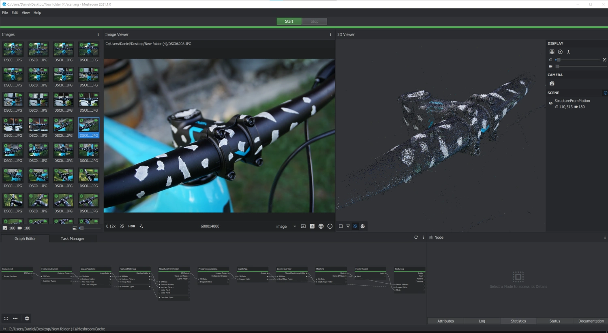

### Trial and Error
It actually took me 4 trials to get a somewhat useful scan of the bike handle and the stem.
* On the first try, I took the Sony Alpha 6000 mirrorless camera and added some pieces of white masking tape to the handle. The results were okay, but I wanted to have even better results - especially around the area of the stem.
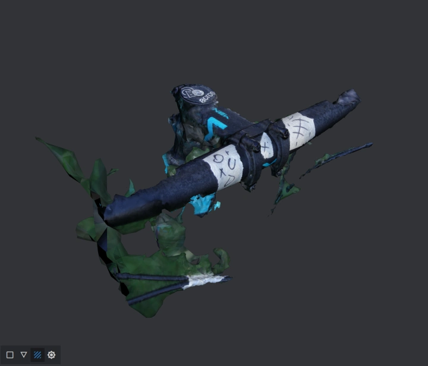
* Next up I tried the main camera of the Samsung Galaxy S21. I just wanted to see how far I can get with a phone camera. The results were quite disappointing, to be honest.
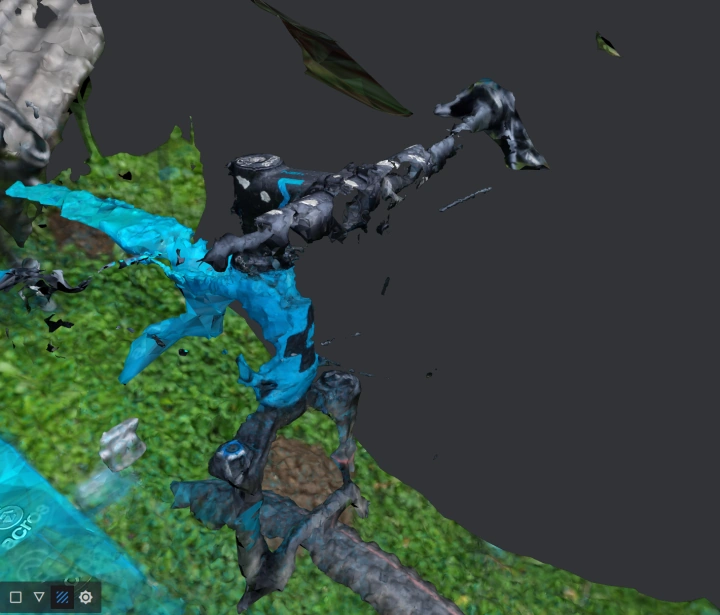
* I still did not give up the idea of using my phone to *scan* the object. Besides the difference in image quality between my Sony's and Samsung's images, the most obvious difference was the [depth of field (DOF)](https://en.wikipedia.org/wiki/Depth_of_field). As you might expect, the mirrorless camera had much more background blur. I thought this might help the algorithms to focus more on the object and less on the background. To prove this theory, I have tried to use the 3x zoom lens on the Galaxy S21. Also here, the results were not what I expected.
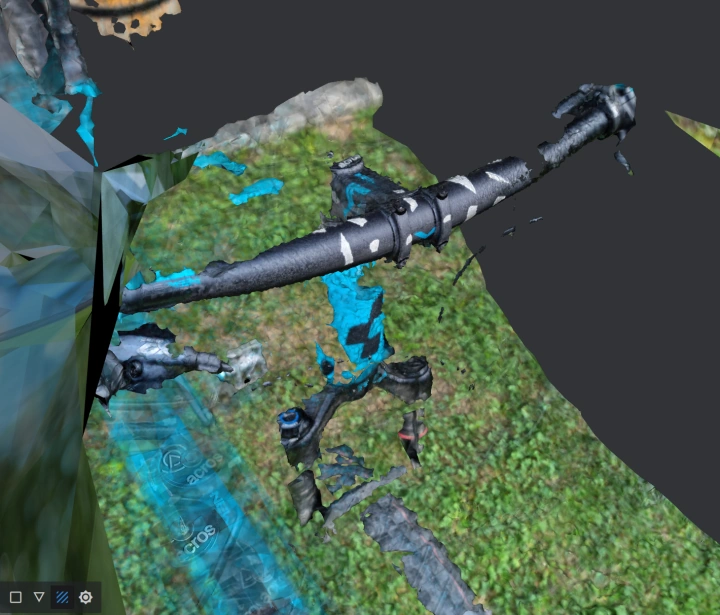
* Last but not least, I went back to the Sony Alpha and added even more pieces of white masking tape to help the algorithms, by providing distinguishable reference points all over the bike handle and stem.
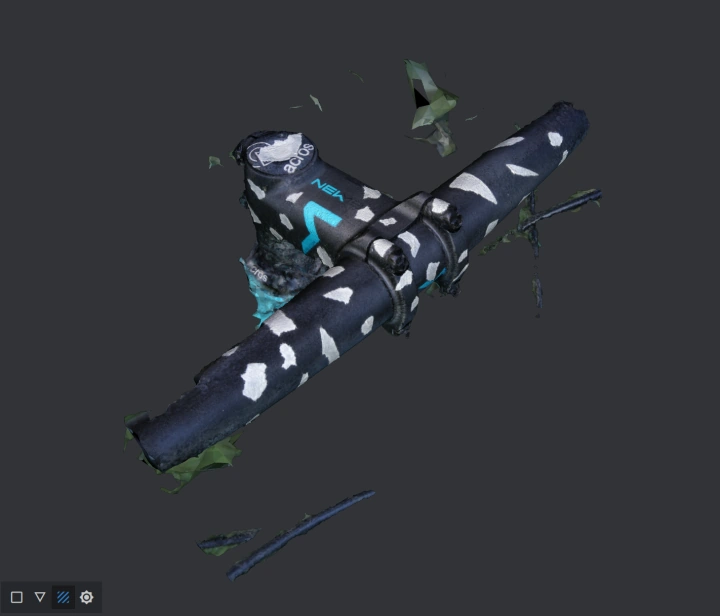

### Miscellaneous
#### Meshroom Camera Intrinsics
When importing images into Meshroom you will see a yellow or green aperture symbol in the top left corner of the images. The yellow symbol shows that the camera intrinsics are approximated by the given metadata of the image. On contrary, the green aperture means that the camera intrinsics are calculated from the metadata and the camera sensor database.

In the case of the Samsung Galaxy S21, the sensor was not present in the database and therefore I got the following camera intrinsics:
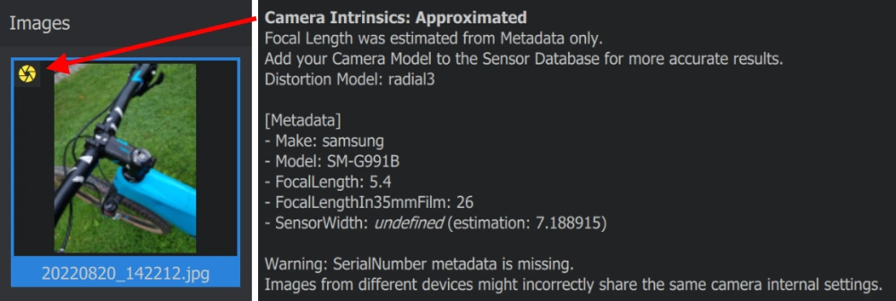

Using the [Meshroom guide on GitHub](https://github.com/alicevision/Meshroom/wiki/Add-Camera-to-database) I have added the phone's sensor to the database and got the following results:
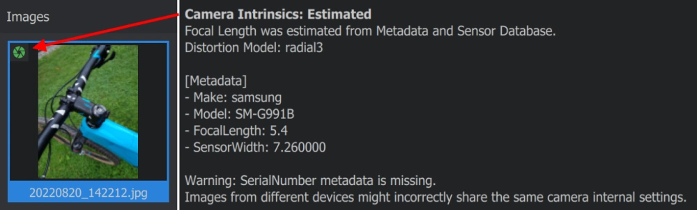

Since it took me quite some time to get reliable information about the sensor size of the main camera on the Galaxy S21, I thought it makes sense to also contribute to the Meshroom/AliceVision project by creating a [pull request (PR)](https://github.com/alicevision/AliceVision/pull/1205) for adding the sensor to the database.

#### Using MeshLab for cleaning up the Scan
As you can see in the [*Trial and Error* section](#trial-and-error) above, some scans collect a lot of unwanted background stuff. I have used the FOSS tool MeshLab to clean up the model following [this guide on YouTube](https://www.youtube.com/watch?v=m2nmeJj5Ij4).

## Final Design
After cleaning the model and exporting it as an STL file, it was imported into Fusion 360. Before the model can be used to design the holder it is necessary to scale it to fit real-life dimensions. Fortunately, Fusion offers an easy-to-use scale feature. 
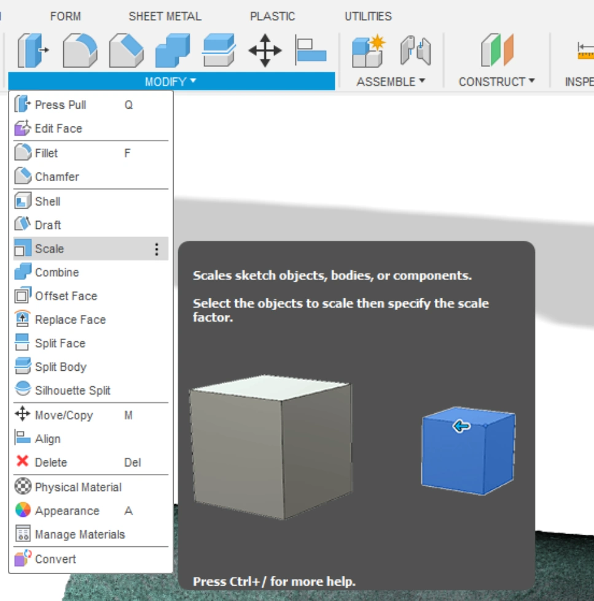

You just need a reference point to compare the dimensions. In my case, I took the distance of the screws in the stem. Then you just divide the real-life value by the one you measured in your model. The result gives you then the scaling factor.
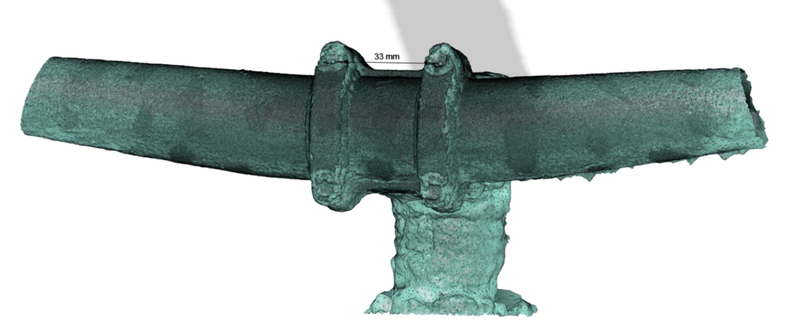

Then the already designed clip interface was imported into this assembly. Even though I want to mount the light on the bottom of the bike stem, the design was done on the top side, since the scan was much better on the top of the stem. This was only possible because the stem showed symmetry between the top and bottom half.
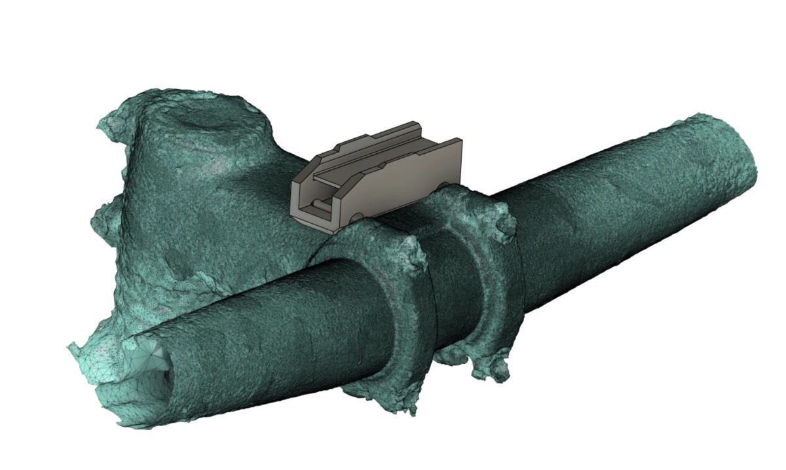

In the last step, the clip interface model was adapted to be mounted with the existing screws that hold the bike handle to the stem. By just using longer screws and cutting threads into the holes of the 3D printed part, it can be mounted without any additional modifications to the bike. Of course, also a chamfer was added to the part to interface more nicely with the stem.
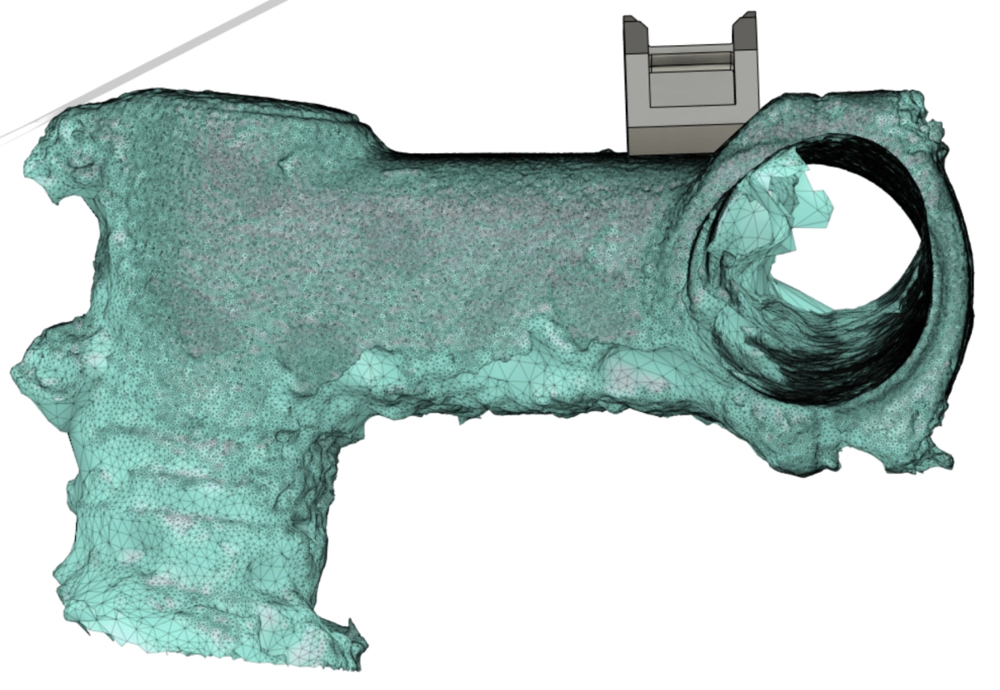

# Result and Conclusion

* Overall I am happy with how the mount turned out. It only adds a few grams to the bike and it is mounted rock solid. Also in case of a mild crash, it is much more protected on the bottom side of the stem - compared to how typical bike lights are mounted.
* The modifications can quickly be undone and besides the changed screws the bike remained untouched.
* I am definitely looking forward to using photogrammetry more often for designing around complex shapes. Although, I have to admit that it was a bit overkill for this project.
* The other thing I have learned is that photogrammetry is a very time-consuming process. Not only does it take some time to prepare the object and take the pictures, but also a lot (if not the most) of time spent is waiting for the model to be generated.
* The bike light in action:
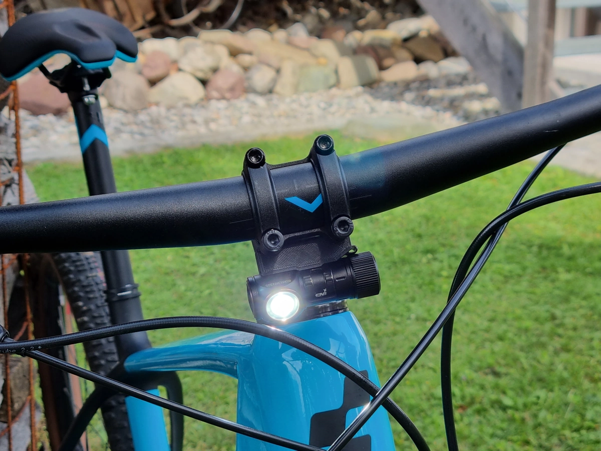
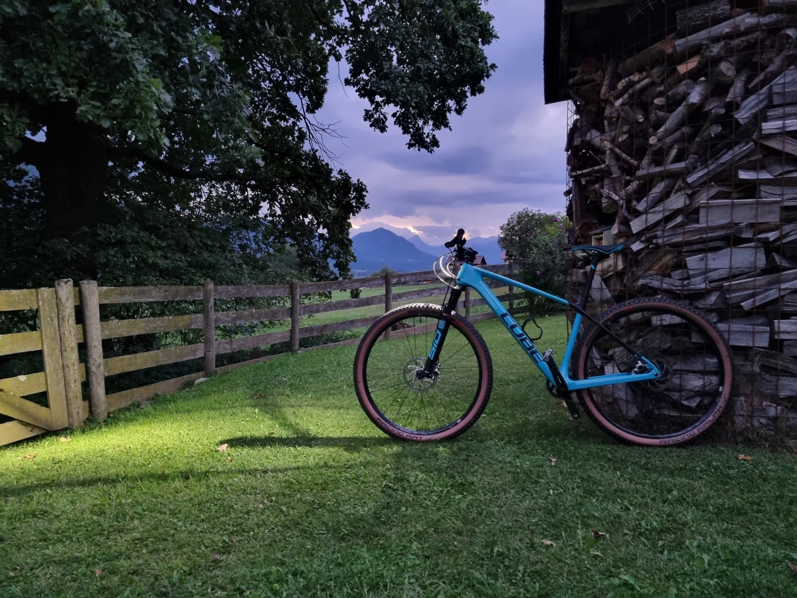
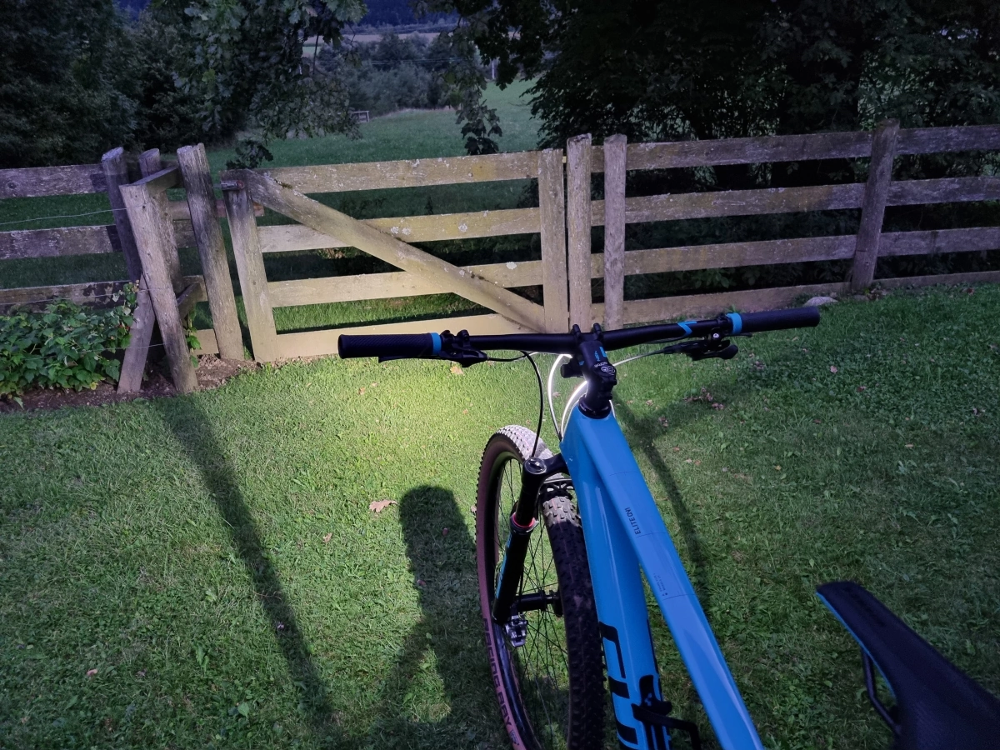