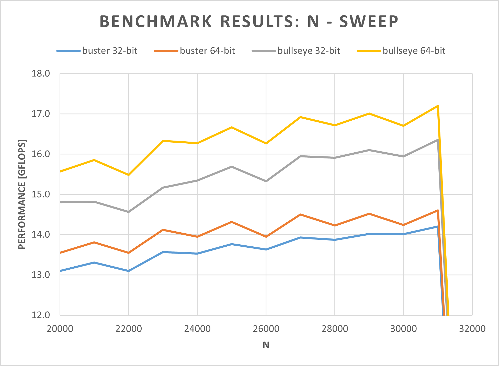

*A guide on how to run the HPL benchmark on a Raspberry Pi 4B. Various Rasbpian OS versions are used (buster, bullseye, 32-bit, 64-bit) and the results are compared.*

<!--more-->

# Why the HPL Benchmark?
One major reason for choosing the [HPL benchmark](https://www.netlib.org/benchmark/hpl/) is the ability to either run it on 32-bit or 64-bit systems and different architectures such as ARM, x86, and x86-64. Another benefit of choosing this benchmark is its extensive use in research ([1]-[8]) for measuring the performance of single board computers and single board computer clusters. This already brings me to the next reason. The HPL benchmark can be used to also benchmark computer clusters. In fact, this is the main use-case of this benchmark. Therefore, it is no wonder that it is also used for the list of  [Top500](https://www.top500.org/project/top500_description/) - a list of the currently leading supercomputers worldwide.


# Hardware

### Setup
- Raspberry Pi 4B 8GB with C0T [stepping](https://en.wikipedia.org/wiki/Stepping_level)
- SanDisk Ultra microSDHC UHS-I Class 10 A1 (up to 120MB/s)
- Official USB C power supply (5.1V, 3A)
- Seeed Studio [Black Warrior ICE Tower](https://www.mouser.at/new/seeed-studio/seeed-studio-black-warrior-fan/) CPU Cooling Fan (see [cover image](images/pi.webp))

### CPU C0T stepping
The C0T stepping basically allows the Raspberry Pi 4B to run 1.8GHz out of the box (only on bullseye) compared to the 1.5GHz found on the B0T stepping level. Jeff Geerling created a nice [video](https://www.youtube.com/watch?v=FkMfN9GvslM) on that topic. According to some quick [tests from him](https://www.jeffgeerling.com/blog/2020/raspberry-pi-400-teardown-and-review), this results in a measurable performance increase of approx. 18% using the Phoronix benchmark.

GitHub user [pelwell](https://github.com/pelwell) states that [two other problem fixes](https://github.com/raspberrypi/linux/issues/3210#issuecomment-680007995) are included in this stepping:
- The EMMC2 bus can only directly address the first 1GB.
- The PCIe interface can only directly address the first 3GB.

Besides the model number on the SoC itself, the stepping can also be determined by [checking the bus decleration of the SD card controller](https://github.com/raspberrypi/linux/issues/3210#issuecomment-680035201):
```bash
# B0
pi@raspberrypi:~$ od -An -tx1 /proc/device-tree/emmc2bus/dma-ranges
 00 00 00 00 c0 00 00 00 00 00 00 00 00 00 00 00
 40 00 00 00

# C0
pi@raspberrypi:~$ od -An -tx1 /proc/device-tree/emmc2bus/dma-ranges
 00 00 00 00 00 00 00 00 00 00 00 00 00 00 00 00
 fc 00 00 00
```


# Software

### Operating Sytems
- RaspiOS lite buster armhf (32-bit) 2021-05-07
- RaspiOS lite buster arm64 (64-bit) 2021-05-07
- RaspiOS lite bullseye armhf (32-bit) 2021-10-30
- RaspiOS lite bullseye arm64 (64-bit) 2021-10-30

### Benchmark Software
- [HPL benchmark](https://www.netlib.org/benchmark/hpl/) in the latest version (v2.3) compiled on the Pi
- [MPICH](https://www.mpich.org/) in the latest version (v3.4.2) compiled on the Pi
- [OpenBLAS](https://github.com/xianyi/OpenBLAS) in the latest version (v0.3.19) compiled on the Pi


# System Configuration Overview
- Disabled HDMI output
- CPU governor set to performance (no clocking down in idle)
- Disabled BT and WiFi
- Disabled swap
- Disabled system logs
- GPU memory set to minimum (16MB)
- Enabled SSH
- Hostname set to 'raspberrypi'
- User and password are kept at default ('pi' and 'raspberry')


# Setting up the Pi
1. Format the SDCard with the [official SD Association Formatter](https://www.sdcard.org/downloads/formatter/)
2. Flash the desired [OS image](https://downloads.raspberrypi.org/) onto the SDCard
3. Before inserting the SDCard the first time:
	- Add a ssh file to enable the SSH functionality
	- In 'config.txt' add:
```
dtoverlay=disable-wifi
dtoverlay=disable-bt
boot_delay=1
gpu_mem=16
```
4. Insert the SDCard and power on for the first time
5. Connect via SSH (I use [PuTTY](https://www.putty.org/))
6. Update all packages:
   ```bash
   sudo apt-get update
   sudo apt-get upgrade
   ```
8. Open ```init.d``` script with ```sudo nano /etc/init.d/raspi-config``` to use ```performance``` as the default CPU governor when not booting with shift key pressed.
9. Open ```rc.local``` script with ```sudo nano /etc/rc.local``` and enter the following before ```exit 0```: 
   ```bash
   # Disable HDMI
   /usr/bin/tvservice -o
   ```
10. Reboot and check if the governor is set to performance with the following command:

    ```cat /sys/devices/system/cpu/cpu0/cpufreq/scaling_governor```
11. Disable swap with: 

	```systemctl disable dphys-swapfile```
12. Reboot and check if swap is disabled by looking at the memory using the command:

	```free```


# Setting up the Benchmark
0. Install [git](https://git-scm.com/) using ```sudo apt-get -y install git```
1. Install [Fortran77](https://en.wikipedia.org/wiki/Fortran#FORTRAN_77) using ```sudo apt-get -y install gfortran```
2. Install MPICH v3.4.2 using the following commands:
	1. ```wget http://www.mpich.org/static/downloads/3.4.2/mpich-3.4.2.tar.gz```
	2. ```tar xvf mpich-3.4.2.tar.gz```
	3. ```cd mpich-3.4.2```
	4. This step depends on the OS version
		- buster (32 & 64-bit):
			```./configure --prefix=/opt/mpich/3.4.2/ --enable-fast --with-device=ch3```
		- bullseye (64-bit):
			```./configure --prefix=/opt/mpich/3.4.2/ --enable-fast --with-device=ch3 FFLAGS=-fallow-argument-mismatch ```
		- bullseye (32-bit):
			```./configure --prefix=/opt/mpich/3.4.2/ --enable-fast --with-device=ch3 FFLAGS=-fallow-argument-mismatch ```
		
			Additionally, in the file ```src/binding/fortran/use_mpi_f08/mpi_f08_types.f90```, the ```real128``` and ```complex128```
			declarations as well as the associated subroutines need to be commented out. More info on that issue and workaround: [Stack Overflow](https://stackoverflow.com/questions/63892055/fortran-error-type-mismatch-between-two-unrelated-subroutine-calls), [MPICH](https://lists.mpich.org/pipermail/discuss/2021-March/006168.html), [GCC](https://gcc.gnu.org/bugzilla/show_bug.cgi?id=91731)
	5. ```make```
	6. ```sudo make install```
3. Install OpenBLAS using the following commands:
    1. ```sudo apt -y remove libopenblas-dev libopenblas-base openmpi-bin```
    2. ```cd```
    3. ```export PATH=/opt/mpich/3.4.2/bin:$PATH```
    4. ```git clone https://github.com/xianyi/OpenBLAS.git```
    5. ```cd OpenBLAS```
    6. ```make```
    7. ```sudo make PREFIX=/opt/openblas install```
4. Install HPL v2.3 using the following commands:
    1. ```cd```
    2. ```wget https://www.netlib.org/benchmark/hpl/hpl-2.3.tar.gz```
    3. ```tar xvf hpl-2.3.tar.gz```
    4. ```cd hpl-2.3```
    5. ```export LD_LIBRARY_PATH=/opt/openblas/lib:$LD_LIBRARY_PATH```
    6. ```export LIBRARY_PATH=/opt/openblas/lib:$LIBRARY_PATH```
    7. ```./configure --prefix=/opt/hpl```
    8. ```make```
    9. ```sudo make install```
5. Open ```bashrc``` using ```sudo nano ~/.bashrc``` and add the following lines to the end of the file:
```bash
export PATH=/opt/mpich/3.4.2/bin:$PATH
export LD_LIBRARY_PATH=/opt/openblas/lib:$LD_LIBRARY_PATH
export LIBRARY_PATH=/opt/openblas/lib:$LIBRARY_PATH
export OPENBLAS_NUM_THREADS=1
```


# Running the Benchmark

### HPL Config File
First, an HPL config file needs to be created:
1. ```cd```
2. ```cd /opt/hpl/bin/```
3. ```sudo nano HPL.dat```
4. Copy the following config to this file and modify to your needs:
```
HPLinpack benchmark input file
Innovative Computing Laboratory, University of Tennessee
HPL.out      output file name (if any)
6            device out (6=stdout,7=stderr,file)
1            # of problems sizes (N)
29000        Ns
1            # of NBs
120          NBs
0            PMAP process mapping (0=Row-,1=Column-major)
1            # of process grids (P x Q)
1            Ps
4            Qs
-16.0        threshold
1            # of panel fact
2            PFACTs (0=left, 1=Crout, 2=Right)
1            # of recursive stopping criterium
4            NBMINs (>= 1)
1            # of panels in recursion
2            NDIVs
1            # of recursive panel fact.
0            RFACTs (0=left, 1=Crout, 2=Right)
1            # of broadcast
2            BCASTs (0=1rg,1=1rM,2=2rg,3=2rM,4=Lng,5=LnM)
1            # of lookahead depth
1            DEPTHs (>=0)
0            SWAP (0=bin-exch,1=long,2=mix)
64           swapping threshold
0            L1 in (0=transposed,1=no-transposed) form
0            U  in (0=transposed,1=no-transposed) form
1            Equilibration (0=no,1=yes)
8            memory alignment in double (> 0)
```
5. Save file (```^X``` to exit; followed by ```Y``` to save)

### Starting the Benchmark
The benchmark can then be started inside the ```/opt/hpl/bin/``` folder by using the command:

```mpiexec -np 4 ./xhpl``` (-np 4 sets the number of processes to 4)

💡 **Tip:**
It also makes sense to display the CPU temperature and the thermal throttling flag, after the benchmark is finished.
You might also want to save the results to a log file.
This command combines all-in-one:

```(mpiexec -np 4 ./xhpl && vcgencmd measure_temp && vcgencmd get_throttled) | sudo tee benchmark_log.txt```

# Results and Interpretation
All 4 OS versions have been benchmarked using the steps mentioned in the previous chapters. For each benchmark, the same HPL config has been chosen. However, the **NB** and **N** parameters have been tuned on each OS version individually - to achieve maximum performance.

### Benchmarking Procedure
1. Sweep through the following NB parameters using a constant N of 20000:

```88 96 104 112 120 128 136 144 152 160 168 176 184 192 200 208 216 224 232 240``` 

2. The NB value that achieved the highest performance is then used for sweeping through the following N parameters:

```20000 21000 22000 23000 24000 25000 26000 27000 28000 29000 30000 31000 32000 33000```

### What to expect?
The Pi Model 4B uses the BCM2711C0 SoC - a Cortex-A72 chip - with 4 cores each capable of 4 double-precision floating-point operations per clock cycle [9]-[13]. Using the following formula, the theoretically possible performance can be calculated:

**FLOPS = F<sub>clock</sub>[Hz] * FLOP/cycle * N<sub>cores</sub>**

This gives:
- **buster:** 24.0 GFLOPS
- **bullseye:** 28.8 GFLOPS (because of +20% clock freq.)

### Results



### Interpretation
As it can be seen in the NB-sweep figure, an NB value of 104 gives the best performance - except for buster 32-bit, where the peak is at NB=112. For the N-sweep, the result is more uniform. All OS versions peak at N=31000. At N=32000, the benchmark already *"crashes"*. To optimize even further, it would make sense to choose an N value that is a multiple of NB.

| **OS Version**  | **Theoretical Performance [GFLOPS]** | **Measured Performance [GFLOPS]** | **Benchmark Efficiency [%]** |
|-----------------|-------------------------------------:|----------------------------------:|-----------------------------:|
| buster 32-bit   |                                 24.0 |                            14.203 |                           59 |
| buster 64-bit   |                                 24.0 |                            14.600 |                           61 |
| bullseye 32-bit |                                 28.8 |                            16.353 |                           57 |
| bullseye 64-bit |                                 28.8 |                            17.198 |                           60 |

The table above shows a comparison of the measured performances for the different OS versions. Interesting here is the *Benchmark Efficiency*[^1]. This efficiency indicates how much of the theoretical performance could be measured by the benchmark. As it can be seen the new bullseye OS achieves a lower benchmark efficiency, compared to buster. However, the measured performance is still higher.

[^1]: This is just my naming for this parameter. If you know the official name, please send me an e-mail. 😃

### What can be concluded?
It can be said, that the new bullseye OS gives an expected performance boost of approx. 20 %. Additionally, there is also a slight performance increase when switching from 32-bit to 64-bit. However, this performance difference is nowhere close to the values measured by [Matteo Croce](https://matteocroce.medium.com/), when he [compared Debian 32-bit to the aarch64 build of Debian](https://matteocroce.medium.com/why-you-should-run-a-64-bit-os-on-your-raspberry-pi4-bd5290d48947) on a Raspberry Pi 4B using the [dhrystone](https://en.wikipedia.org/wiki/Dhrystone) benchmark. There he saw a performance increase of approx. 51 %.

# References and Links

[1] D. Papakyriakou, D. Kottou, and I. Kostouros, “Benchmarking Raspberry Pi 2 Beowulf Cluster”, International Journal of Computer Applications, vol. 179, no. 32, pp. 21–27, Apr. 2018. doi: [10.5120/ijca2018916728](https://doi.org/10.5120/ijca2018916728).

[2] E.-L. Bleeker and M. Reinholdsson, “Creating a Raspberry Pi-BasedBeowulf Cluster”, M.S. thesis, Karlstad University, 2017. [Online]. Available: https://www.diva-portal.org/smash/get/diva2:1110319/FULLTEXT02.pdf (visited on 02/26/2022).

[3] B. Dye, “DISTRIBUTED COMPUTING WITH THE RASPBERRY PI”, M.S. thesis, Kansas State University, 2014. [Online]. Available: https://www.collectionbooks.net/pdf/distributed-computing-with-the-raspberry-pi (visited on 02/26/2022).

[4] C. Baun, “Performance and Energy-Efficiency Aspects of Clusters of Single Board Computers”, International Journal of Distributed and Parallel systems, vol. 7, no. 2 / 3 / 4, pp. 13–22, Jul. 2016. doi: [10.5121/ijdps.2016.7402](https://doi.org/10.5121/ijdps.2016.7402).

[5] P. J. Basford, S. J. Johnston, C. S. Perkins, et al., “Performance analysis of single board computer clusters”, Future Generation Computer Systems, vol. 102, pp. 278–291, Jan. 2020. doi: [10.1016/j.future.2019.07.040](https://doi.org/10.1016/j.future.2019.07.040).

[6] E. Wilcox, P. Jhunjhunwala, K. Gopavaram, and J. Herrera, Pi-Crust : A Raspberry Pi Cluster Implementation, 2015. [Online]. Available: http://jorgehc.com/files/pi_crust_paper.pdf (visited on 02/26/2022).

[7] R. Longbottom, “Raspberry Pi 64 Bit OS and 8 GB Pi 4B Benchmarks”, en, 2020. doi: [10.13140/RG.2.2.22698.44489](https://doi.org/10.13140/RG.2.2.22698.44489).

[8] ——, “Raspberry Pi 4B Stress Tests Including High Performance Linpack”, en, 2019. doi: [10.13140/RG.2.2.13784.85767](https://doi.org/10.13140/RG.2.2.13784.85767).

[9] Raspberry Pi Foundation, Raspberry Pi 4 Tech Specs. [Online]. Available: https://www.raspberrypi.org/products/raspberry-pi-4-model-b/specifications/ (visited on 02/26/2022).

[10] Broadcom Europe Ltd., Raspberry Pi Trading Lt., BCM2711 ARM Peripheral. [Online]. Available: https://datasheets.raspberrypi.org/bcm2711/bcm2711-peripherals.pdf (visited on 02/26/2022).

[11] WikiChip LLC, Floating-Point Operations Per Second (FLOPS). [Online]. Available: https://en.wikichip.org/wiki/flops (visited on 02/26/2022).

[12] Arm Limited, Cortex-A72. [Online]. Available: https://developer.arm.com/ip-products/processors/cortex-a/cortex-a72 (visited on 02/26/2022).

[13] A. Frumusanu, ARM Reveals Cortex-A72 Architecture Details. [Online]. Available: https://www.anandtech.com/show/9184/arm-reveals-cortex-a72-architecture-details (visited on 02/26/2022).
