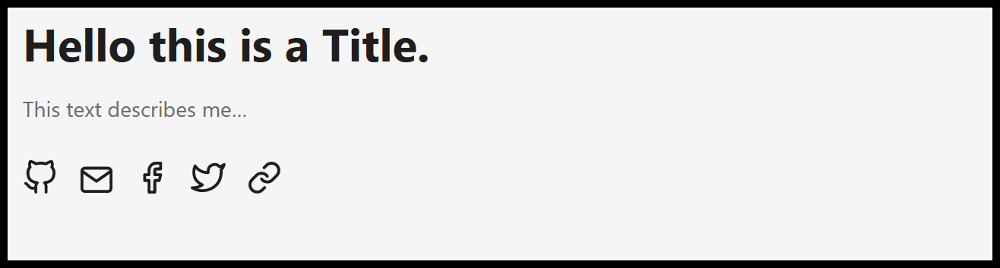

*A quick guide on how to customize the Home-Info field of the Hugo PaperMod theme.*

<!--more-->

The Hugo PaperMod theme has become a quite popular blog theme [since 2021](https://adityatelange.in/blog/papermod-went-viral/). In fact, also this blog is built on the [Hugo framework](https://github.com/gohugoio/hugo) in combination with the [PaperMod theme](https://github.com/adityatelange/hugo-PaperMod). In my opinion, the optional [*Home-Info* mode](https://github.com/adityatelange/hugo-PaperMod/wiki/Features#home-info-mode) is the most beautiful layout you can choose in this theme (see below).



However, two things slightly bother me. First, it would be nice if there was the option to add a profile picture next to the text. And the second improvement I would wish for is the option to use custom social link icons.

Hence, I developed the following solution for me. I simply use HTML formatting in config-file where the *homeInfoParams:* are described. This way, it is super easy to create a custom design for this layout. In order to get this working properly, it must be ensured that the markup [goldmark](https://gohugo.io/getting-started/configuration-markup/#goldmark) renderer supports HTML.

Here is my example configuration for the goldmark renderer (in config.yaml):
```yaml
markup:
  goldmark:
    extensions:
      definitionList: true
      footnote: true
      linkify: true
      strikethrough: true
      table: true
      taskList: true
      typographer: true
    parser:
      attribute:
        block: false
        title: true
      autoHeadingID: true
      autoHeadingIDType: github
    renderer:
      hardWraps: false
      unsafe: true # <- this enables HTML rendering
      xhtml: false
```

After changing this you can use HTML syntax in the *homeInfoParams:* config (in config.yaml):
```yaml
homeInfoParams:
	Title: Hi there, I'm Daniel. 👋
	Content: >
		<div>  <!--- profile picture and text --->
			<p style="float: left; padding-right: 10px;">
				
			</p>
			<p>
				Everything technical gives me a lot of joy. Starting from <b>A</b> like <i>Artificial Intelligence</i> to <b>Z</b> like <i>Zener Diode</i> - I dig that stuff! 
				This blog is a collection of the thoughts, ideas, and projects that I would like to share with the world wide web.
			</p>
		</div>
		
		<div> <!--- social icons start here --->
			<a href="https://github.com/dadul96">
				<p style="float: left; padding-top: 20px; padding-right: 15px;">
					
				</p>
			</a>
			<a href="mailto:daniel.duller@gmx.net">
				<p style="float: left; padding-top: 20px; padding-right: 15px;">
					
				</p>
			</a>
			<a href="https://www.thingiverse.com/dadul96/designs">
				<p style="float: left; padding-top: 20px; padding-right: 15px;">
					
				</p>
			</a>
			<a href="https://www.prusaprinters.org/social/192589-dadul96/about">
				<p style="float: left; padding-top: 20px; padding-right: 15px;">
					
				</p>
			</a>
			<a href="https://dadul96.github.io/index.xml">
				<p style="float: left; padding-top: 20px; padding-right: 15px;">
					
				</p>
			</a>
		</div>
```

The icons which you use in the HTML code are stored in "hugo_project_name/static/".

As a result, you would get a design that is similar to my currently used one:
