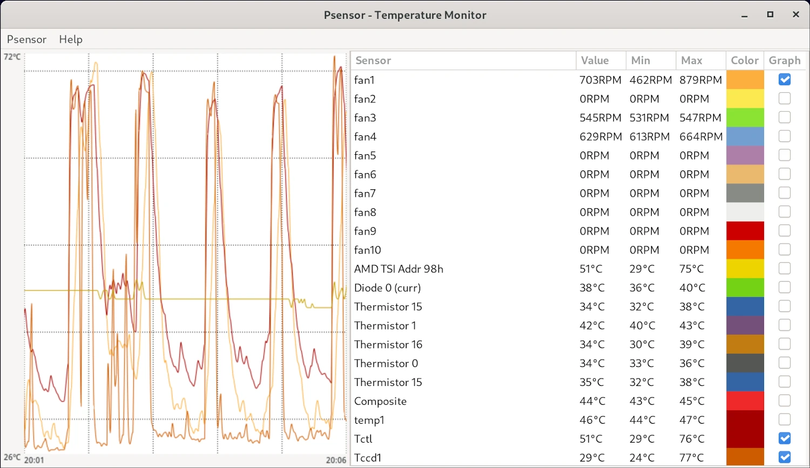
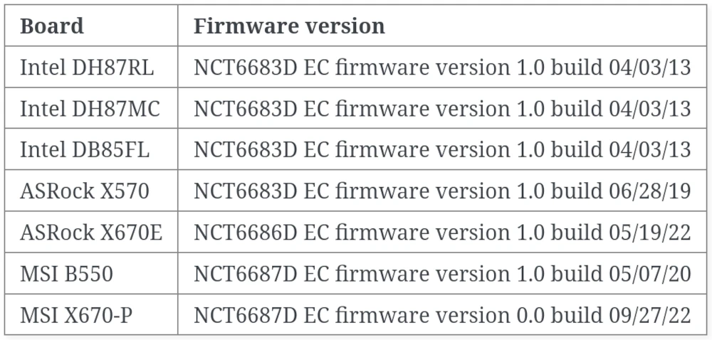

*On my Debian Bookworm system, the `sensors`-command does not give me all available hardware info of my MSI MPG B550 Gaming Edge Wifi motherboard. This guide shows how to fix this.*

<!--more-->

When I run the `sensors` command I only get the following terminal output:
```bash
daniel@daniel-ms7c91 ~> sensors
iwlwifi_1-virtual-0
Adapter: Virtual device
temp1:            N/A  

nvme-pci-0400
Adapter: PCI adapter
Composite:    +44.9°C  (low  =  -5.2°C, high = +79.8°C)
                       (crit = +84.8°C)

k10temp-pci-00c3
Adapter: PCI adapter
Tctl:         +42.5°C  
Tccd1:        +30.2°C 
```

However, I expect there to be more system temperatures as well as some RPM values for the PWM-controlled fans. After some research on Google, it seems that there might be a missing kernel driver module for the motherboard I/O controller.

On the MSI product page for the [MSI MPG B550 Gaming Edge Wifi motherboard](https://www.msi.com/Motherboard/MPG-B550-GAMING-EDGE-WIFI/Specification), it is mentioned that the I/O controller chip is the so-called `NUVOTON NCT6687-R`. Another web search took me to the following [source](https://kernelnewbies.org/Linux_5.11#Hardware_monitoring__.28hwmon.29) which indicated that the driver module for this chip has already been implemented, starting from Linux kernel v5.11. Its name is a bit misleading because the changelog mentions *"nct6683: Support NCT6687D"* and my motherboard has the *"NCT6687-R"*. Nevertheless, this seems to be the correct (and more importantly) working driver for my system.

To temporarily test this driver, I run the command `sudo modprobe nct6683` and check the result of the `sensors` command:
```bash
daniel@daniel-ms7c91 ~> sudo modprobe nct6683
daniel@daniel-ms7c91 ~> sensors
iwlwifi_1-virtual-0
Adapter: Virtual device
temp1:            N/A  

nvme-pci-0400
Adapter: PCI adapter
Composite:    +44.9°C  (low  =  -5.2°C, high = +79.8°C)
                       (crit = +84.8°C)

nct6687-isa-0a20
Adapter: ISA adapter
VIN0:               1.01 V  (min =  +0.00 V, max =  +0.00 V)
VIN1:             992.00 mV (min =  +0.00 V, max =  +0.00 V)
VIN2:             976.00 mV (min =  +0.00 V, max =  +0.00 V)
VIN3:             592.00 mV (min =  +0.00 V, max =  +0.00 V)
VIN4:             912.00 mV (min =  +0.00 V, max =  +0.00 V)
VIN5:             816.00 mV (min =  +0.00 V, max =  +0.00 V)
VIN6:             704.00 mV (min =  +0.00 V, max =  +0.00 V)
VIN7:               1.55 V  (min =  +0.00 V, max =  +0.00 V)
VCC:                3.33 V  (min =  +0.00 V, max =  +0.00 V)
VTT:                1.82 V  (min =  +0.00 V, max =  +0.00 V)
fan1:              530 RPM  (min =    0 RPM)
fan2:                0 RPM  (min =    0 RPM)
fan3:              546 RPM  (min =    0 RPM)
fan4:              663 RPM  (min =    0 RPM)
fan5:                0 RPM  (min =    0 RPM)
fan6:                0 RPM  (min =    0 RPM)
fan7:                0 RPM  (min =    0 RPM)
fan8:                0 RPM  (min =    0 RPM)
fan9:                0 RPM  (min =    0 RPM)
fan10:               0 RPM  (min =    0 RPM)
AMD TSI Addr 98h:  +36.0°C  (low  =  +0.0°C)
                            (high =  +0.0°C, hyst =  +0.0°C)
                            (crit =  +0.0°C)  sensor = AMD AMDSI
Diode 0 (curr):    +39.0°C  (low  =  +0.0°C)
                            (high =  +0.0°C, hyst =  +0.0°C)
                            (crit =  +0.0°C)  sensor = thermal diode
Thermistor 15:     +36.0°C  (low  =  +0.0°C)
                            (high =  +0.0°C, hyst =  +0.0°C)
                            (crit =  +0.0°C)  sensor = thermistor
Thermistor 1:      +43.0°C  (low  =  +0.0°C)
                            (high =  +0.0°C, hyst =  +0.0°C)
                            (crit =  +0.0°C)  sensor = thermistor
Thermistor 16:     +34.5°C  (low  =  +0.0°C)
                            (high =  +0.0°C, hyst =  +0.0°C)
                            (crit =  +0.0°C)  sensor = thermistor
Thermistor 0:      +36.5°C  (low  =  +0.0°C)
                            (high =  +0.0°C, hyst =  +0.0°C)
                            (crit =  +0.0°C)  sensor = thermistor
Thermistor 15:     +36.0°C  (low  =  +0.0°C)
                            (high = +120.0°C, hyst = +33.0°C)
                            (crit =  +0.0°C)  sensor = thermistor
intrusion0:       ALARM
beep_enable:      disabled

k10temp-pci-00c3
Adapter: PCI adapter
Tctl:         +36.6°C  
Tccd1:        +37.0°C 
```

And yes indeed, now I get the expected information from my system. Now the tool [Psensor](https://github.com/chinf/psensor) can be used to display certain parameters graphically :



> &#x26a0;&#xfe0f; After the next reboot the kernel module would be "unloaded" again. To load this driver module on every system boot edit the file `/etc/modules` and add the name of the driver `nct6683`

On the [kernel docs page](https://docs.kernel.org/hwmon/nct6683.html) there is also a list of tested boards and firmware versions:



The following *"Nuvoton NCT"*-kernel drivers are also available:
* [nct6775](https://docs.kernel.org/hwmon/nct6775.html)
* [nct7363](https://docs.kernel.org/hwmon/nct7363.html)
* [nct7802](https://docs.kernel.org/hwmon/nct7802.html)
* [nct7904](https://docs.kernel.org/hwmon/nct7904.html)

