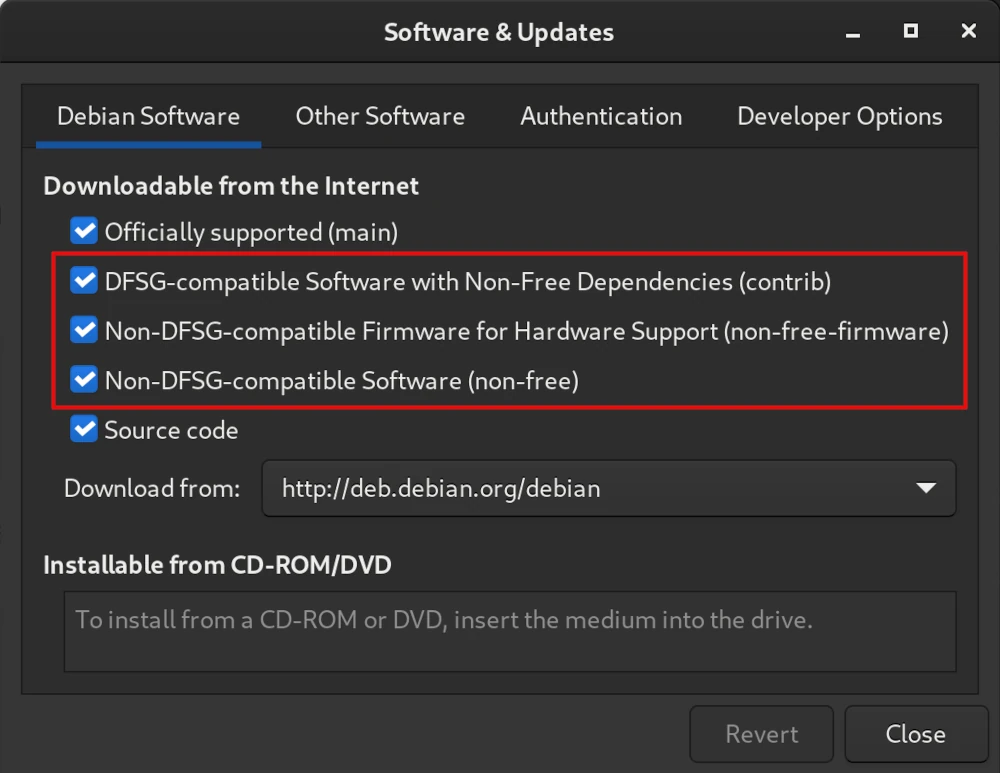
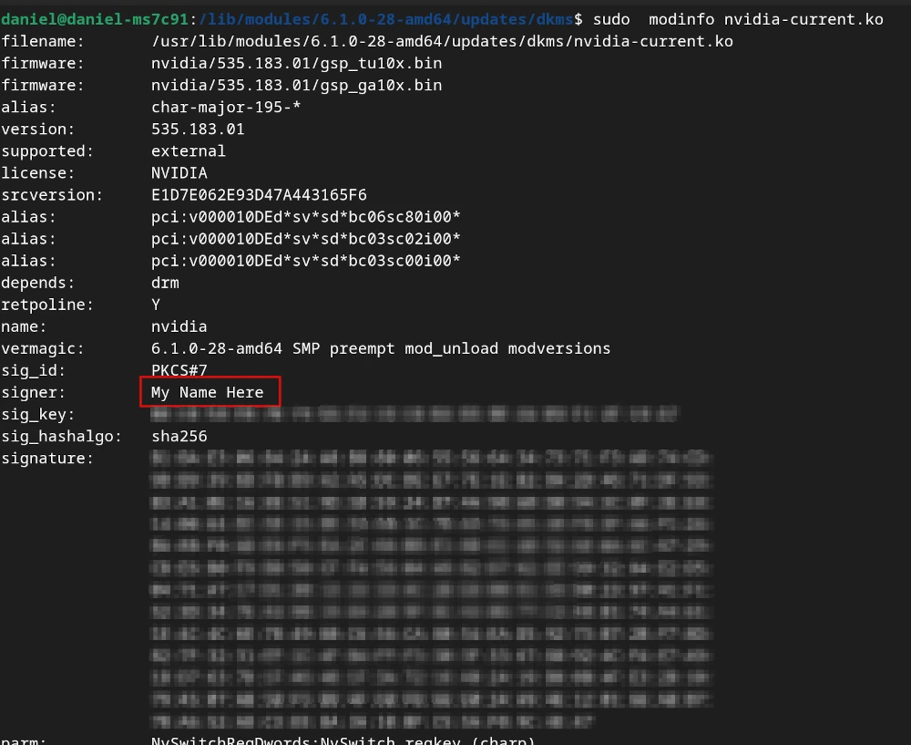
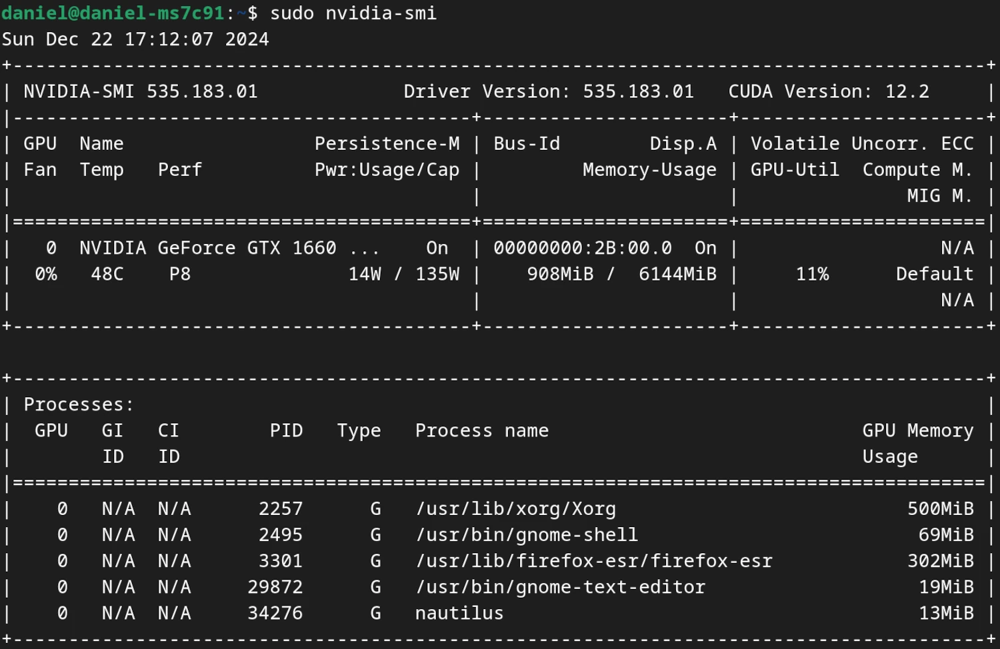

*A guide on how to install non-free Nvidia drivers on Debian Bookworm.*

<!--more-->

## Preface
If you are just here for the instructions then please directly go to the chapter [Installation Instructions](#installation-instructions). In case you are also interested in why I am writing this article stay here.

Approximately two weeks ago, I finally made the decision to switch from Windows 10 to Linux. What bothered me the most about Windows was that they force updates down your throat. Sometimes these updates introduce features (good and bad) and sometimes these updates also introduce a new type of bluescreen.

That's why my decision fell to Debian. I wanted a reliable and stable distro, with very little need for updates. After playing around for two days or so I noticed that I don't have any audio. Since I use audio over HDMI to my monitor it was quite clear to me that this must have something to do with the graphics card driver. A quick check in the package manager (`sudo apt list --installed | grep nvidia`) confirmed that no proprietary Nvidia driver was installed.

As a fresh Linux user, I decided to just run `sudo apt install nvidia-driver`. During installation, I saw the prompt of the conflict with *nouveau* and the need for a reboot, which I performed as requested. Then it all began...if I remember correctly I was greeted with a display resolution that felt like 10 by 12 pixels on my 4K screen. I still thought that I just needed to change the resolution in the settings and that everything would be fine. Negative, there was no option to increase the resolution. Also checking the Nvidia software tool, which was surprisingly installed, showed a mostly empty GUI window.

Since I still was only a few days in, I decided that it would be best to perform a fresh install of Debian. I also played around with other things before and my "inner monk" could not accept this as a clean install anymore.

After the fresh install of Debian, it was time to google the correct way of installing an Nvidia driver. Luckily I stumbled across the official Debian guidelines on installing [NVIDIA Proprietary Driver](https://wiki.debian.org/NvidiaGraphicsDrivers). Additionally, I discovered that the driver needs to be signed in order to work with secure boot (SB). Also here Debian has a whole guide on [Secure Boot](https://wiki.debian.org/SecureBoot) and how [DKMS and secure boot](https://wiki.debian.org/SecureBoot#DKMS_and_secure_boot) work together.

But why do I spend the effort to summarize these guides when everything is already officially documented? Well, I think the official guides are a bit hard to digest for Linux newcomers. Also, I want to document for future me, how I set up the GPU drivers on this system (in case I need/want to perform a clean install again due to another rookie mistake).


## Installation Instructions
### Enabling non-free Firmware/Software
Non-free firmware can be enabled either with the GUI


or by opening the file `nano /etc/apt/sources.list`, and adding the components `contrib`, `non-free`, and `non-free-firmware` to the Debian repository URLs.

Alternatively, you could also run the following command:
`sudo apt-add-repository --component contrib non-free non-free-firmware`.


### Determine which Driver is recommended
First let's fetch the latest version of the package list:
`sudo apt update`

Install the nvidia driver detector:
`sudo apt install nvidia-detect -y`

Run this detector with:
`nvidia-detect`

Then your output will look something like this:
```bash
daniel@daniel-ms7c91 ~> nvidia-detect
Detected NVIDIA GPUs:
2b:00.0 VGA compatible controller [0300]: NVIDIA Corporation TU116 [GeForce
GTX 1660 SUPER] [10de:21c4] (rev a1)

Checking card:  NVIDIA Corporation TU116 [GeForce GTX 1660 SUPER] (rev a1)
Your card is supported by all driver versions.
Your card is also supported by the Tesla 470 drivers series.
It is recommended to install the
    nvidia-driver
package.
```
In my case, the `nvidia-driver` would be fitting.


### Before installing the Driver
Before installing the graphics driver you need to check that the proper kernel headers are installed. In my case, I have an amd64 system and therefore I run the command:
`sudo apt install linux-headers-amd64 -y`

For me, this was already installed.


### Installing the Driver
The driver can then be installed using:
`sudo apt install nvidia-driver firmware-misc-nonfree -y`

[DKMS (Dynamic Kernel Module System)](https://packages.debian.org/bookworm/dkms) will then build the Nvidia module for the system.

During installation, it will give you a console warning message saying something like *`"Conflicting nouveau kernel module loaded ...."`*. At the end, it will be asked to reboot, __**but please wait with the reboot!**__

Due to secure boot we need to sign the Nvidia driver first before we can use it.


### Signing the Nvidia Kernel Module
#### Generate a new Key
1. Install the signing tool: `sudo apt install sbsigntool`
2. Create a folder to store the MOK (Machine Owner Key) file: `sudo mkdir -p /var/lib/shim-signed/mok/`
3. Open the created folder: `sudo cd /var/lib/shim-signed/mok/`
4. Generate the key: `udo openssl req -new -x509 -newkey rsa:2048 -keyout MOK.priv -outform DER -out MOK.der -days 36500 -subj "/CN=My Name Here/"`
5. Convert *.der format to *.pem format: `sudo openssl x509 -inform der -in MOK.der -out MOK.pem`


#### Enrolling the Key
1. Enroll the key: `sudo mokutil --import /var/lib/shim-signed/mok/MOK.der`
2. Check if it worked: `sudo mokutil --test-key /var/lib/shim-signed/mok/MOK.der`

The output print should show something like: `/var/lib/shim-signed/mok/MOK.der is already in the enrollment request`.


#### Adding the Key to DKMS
We need to tell DKMS which key should be used for automatically signing the kernel modules. Therefore, we need to add the following two lines to the file `/etc/dkms/framework.conf`:
```
mok_signing_key="/var/lib/shim-signed/mok/MOK.priv"
mok_certificate="/var/lib/shim-signed/mok/MOK.der"
```

The next step should only be necessary on older or custom kernels, but I will do it anyway - just to be safe:
1. In the same file `/etc/dkms/framework.conf` also add the line: `sign_tool="/etc/dkms/sign_helper.sh"` and save.
2. Create a this sign\_helper script file using: `sudo nano /etc/dkms/sign_helper.sh`
3. Add the line: `/lib/modules/"$1"/build/scripts/sign-file sha512 /root/.mok/client.priv /root/.mok/client.der "$2"` and save.
4. Set this file to be an executable: `sudo chmod +x /etc/dkms/sign_helper.sh`


#### Signing the Kernel and the Kernel Modules
Set the following environment variables:
* `VERSION="$(uname -r)"`
* `SHORT_VERSION="$(uname -r | cut -d . -f 1-2)"`
* `MODULES_DIR=/lib/modules/$VERSION`
* `KBUILD_DIR=/usr/lib/linux-kbuild-$SHORT_VERSION`

To sign the Nvidia modules run:
1. `cd "$MODULES_DIR/updates/dkms"`
2. `read -s KBUILD_SIGN_PIN`
3. Now you need to type in your passphrase and hit ENTER.
4. `export KBUILD_SIGN_PIN`
5. `find -name \*.ko | while read i; do sudo --preserve-env=KBUILD_SIGN_PIN "$KBUILD_DIR"/scripts/sign-file sha256 /var/lib/shim-signed/mok/MOK.priv /var/lib/shim-signed/mok/MOK.der "$i" || break; done`
6. `sudo update-initramfs -k all -u`

To sign the kernel run:
1. `sbsign --key MOK.priv --cert MOK.pem "/boot/vmlinuz-$VERSION" --output "/boot/vmlinuz-$VERSION.tmp"`
2. `sudo mv "/boot/vmlinuz-$VERSION.tmp" "/boot/vmlinuz-$VERSION"`

We can confirm that the Nvidia module was signed by:
1. `cd "$MODULES_DIR/updates/dkms"`
2. `sudo  modinfo nvidia-current.ko`
3. The output should show that you are the signer:



#### Restart the PC and enroll MOK
1. Now you can restart the PC.
2. On restart the MOK management should start.
3. You need to select `Enroll MOK`.
4. Enter your Key/Passphrase.
5. Once boot is finished you should be able to use the Nvidia card. You can verify this with the command `sudo nvidia-smi`:



#### For Wayland Desktop Users (default in Bookworm)
1. Open the nvidia options file: `nano /etc/modprobe.d/nvidia-options.conf`
2. Make sure that the following line is set: `options nvidia-drm modeset=1`

This will enable the Direct Rendering Manager (DRM) kernel mode setting. You can find more on what this means here:
* [DRM kernel mode setting](https://wiki.archlinux.org/title/NVIDIA#DRM_kernel_mode_setting)
* [Direct Rendering Manager](https://en.wikipedia.org/wiki/Direct_Rendering_Manager)
* [Kernel mode setting](https://wiki.archlinux.org/title/Kernel_mode_setting)

Just reboot and you are finished.

